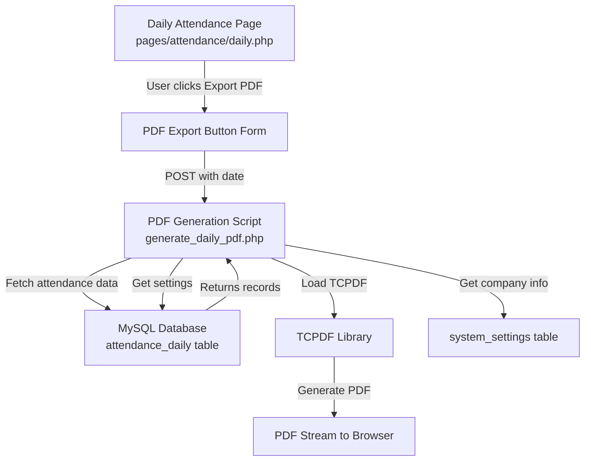

# Design Document: Daily Attendance PDF Export for All Employees

## Overview

This feature adds PDF export functionality to the daily attendance view page (`pages/attendance/daily.php`). Users can select a date and generate a PDF containing all employees' attendance status for that day. The PDF follows the existing report styling from the employee report (company logo, header, table format).

The feature will use TCPDF library (to be installed via Composer) for PDF generation, following the same styling conventions as the existing employee attendance report.

## Architecture



## Components and Interfaces

### Component 1: PDF Export Button (UI Addition)

**Location**: `pages/attendance/daily.php`

**Purpose**: Add an export button to trigger PDF generation

**Interface**:
```php
// Add to filter-bar form or standalone form
<form method="POST" action="generate_daily_pdf.php" target="_blank">
    <input type="hidden" name="date" value="<?= htmlspecialchars($selectedDate) ?>">
    <button type="submit" class="btn btn-success">📄 Export PDF</button>
</form>
```

**Responsibilities**:
- Submit selected date to PDF generation script
- Open PDF in new tab for printing/saving

### Component 2: PDF Generation Script

**Location**: `pages/attendance/generate_daily_pdf.php` (new file)

**Purpose**: Generate PDF document with all employees' attendance for selected date

**Interface**:
```php
// Input: $_POST['date'] or $_GET['date']
// Output: PDF stream with Content-Type: application/pdf

function generateDailyAttendancePDF(string $date): void
```

**Responsibilities**:
- Fetch attendance data for selected date
- Calculate summary statistics
- Generate styled PDF with header, table, and summary
- Stream PDF to browser

### Component 3: PDF Data Model

**Data Retrieved from Database**:
```php
interface DailyAttendanceRecord {
    pin: string              // Employee PIN
    emp_name: string         // Employee name
    grade_name: string|null  // Department/Grade name
    shift_name: string|null  // Shift name
    first_in: datetime|null  // Check-in time
    last_out: datetime|null  // Check-out time
    total_hours: float|null  // Total hours worked
    status: string           // present|absent|on_leave|holiday|weekend
    was_late: boolean        // Late flag
    late_minutes: int        // Late minutes
    left_early: boolean      // Early leave flag
    early_minutes: int       // Early minutes
    single_punch: boolean    // Single punch flag
    day_type: string|null    // For holiday/weekend duty
    worked_on_off_day: boolean // Worked on off day flag
}
```

## Data Models

### Input Parameters

```php
interface PDFExportParams {
    date: string              // Required, format YYYY-MM-DD
    include_department: bool  // Optional, default true
    include_shift: bool       // Optional, default true
}
```

### Output PDF Structure

```php
interface PDFOutputStructure {
    header: {
        company_name: string
        company_logo: string
        report_title: string
        date: string
        generated_at: datetime
    }
    summary: {
        present: int
        absent: int
        on_leave: int
        holiday: int
        weekend: int
        late: int
        early_leave: int
    }
    details: DailyAttendanceRecord[]
    footer: {
        page_numbers: boolean
        generation_time: boolean
    }
}
```

## Key Functions with Formal Specifications

### Function 1: fetchAttendanceDataForDate()

```php
function fetchAttendanceDataForDate(PDO $db, string $date): array
```

**Preconditions:**
- `$db` is a valid, connected PDO database instance
- `$date` is a valid date string in 'Y-m-d' format
- The `attendance_daily` table contains processed records

**Postconditions:**
- Returns array of DailyAttendanceRecord objects
- Each record includes employee name, department, shift, times, status, and flags
- Returns empty array if no records exist for the date
- Order by employee name ascending

### Function 2: calculateSummaryStats()

```php
function calculateSummaryStats(array $records): array
```

**Preconditions:**
- `$records` is an array of DailyAttendanceRecord from fetchAttendanceDataForDate()

**Postconditions:**
- Returns associative array with counts:
  - `present`: count of status='present'
  - `absent`: count of status='absent'
  - `on_leave`: count of status='on_leave'
  - `holiday`: count of status='holiday'
  - `weekend`: count of status='weekend'
  - `late`: count where was_late=true
  - `early_leave`: count where left_early=true

### Function 3: generateDailyAttendancePDF()

```php
function generateDailyAttendancePDF(PDO $db, string $date): void
```

**Preconditions:**
- `$db` is a valid, connected PDO database instance
- `$date` is a valid date string in 'Y-m-d' format
- TCPDF library is installed and available via Composer autoload

**Postconditions:**
- Outputs PDF to browser with correct Content-Type headers
- PDF contains company header, summary section, and detail table
- All employee records for the date are included
- No database modifications occur

**Loop Invariants:**
- All records in the detail table have the selected date
- Summary counts match the detail records

### Function 4: formatTimeForPDF()

```php
function formatTimeForPDF(string|null $datetime): string
```

**Preconditions:**
- `$datetime` can be null, empty, or a valid datetime string

**Postconditions:**
- Returns '—' for null/empty values
- Returns time in 'HH:mm' format (e.g., '09:30') for valid datetimes

### Function 5: getStatusLabel()

```php
function getStatusLabel(string $status): string
```

**Preconditions:**
- `$status` is a valid status value from attendance_daily

**Postconditions:**
- Returns human-readable label:
  - 'present' → 'Present'
  - 'absent' → 'Absent'
  - 'on_leave' → 'On Leave'
  - 'holiday' → 'Holiday'
  - 'weekend' → 'Weekend'
  - default → ucfirst($status)

## Algorithmic Pseudocode

### Main PDF Generation Algorithm

```pascal
ALGORITHM generateDailyPDF(date)
INPUT: date of type string (YYYY-MM-DD format)
OUTPUT: PDF stream to browser

BEGIN
    // Step 1: Validate input
    ASSERT validateDate(date) = true
    
    // Step 2: Connect to database
    db ← connectDatabase()
    
    // Step 3: Fetch attendance records
    records ← fetchAttendanceDataForDate(db, date)
    
    // Step 4: Calculate summary statistics
    summary ← calculateSummaryStats(records)
    
    // Step 5: Get company settings
    companyName ← getSetting(db, 'company_name', 'Company')
    logoPath ← getSetting(db, 'company_logo_path', 'assets/logo.png')
    
    // Step 6: Initialize TCPDF
    pdf ← new TCPDF('P', 'mm', 'A4', true, 'UTF-8')
    pdf->SetCreator('Attendance System')
    pdf->AddPage()
    
    // Step 7: Render header
    renderHeader(pdf, companyName, logoPath, date)
    
    // Step 8: Render summary section
    renderSummary(pdf, summary, date)
    
    // Step 9: Render detail table
    renderDetailTable(pdf, records)
    
    // Step 10: Output PDF
    pdf->Output('Daily_Attendance_' + date + '.pdf', 'I')
    
    ASSERT pdf was output successfully
END
```

**Preconditions:**
- Date parameter is valid and in correct format
- Database connection is active
- TCPDF library is available

**Postconditions:**
- PDF is generated with all attendance data for the date
- Summary counts are accurate
- PDF streams to browser for user download/view

### Summary Calculation Algorithm

```pascal
ALGORITHM calculateSummaryStats(records)
INPUT: records - array of attendance records
OUTPUT: summary - associative array of counts

BEGIN
    summary ← {
        present: 0,
        absent: 0,
        on_leave: 0,
        holiday: 0,
        weekend: 0,
        late: 0,
        early_leave: 0
    }
    
    FOR each record IN records DO
        SWITCH record.status
            CASE 'present':
                summary.present ← summary.present + 1
                IF record.was_late = true THEN
                    summary.late ← summary.late + 1
                END IF
                IF record.left_early = true THEN
                    summary.early_leave ← summary.early_leave + 1
                END IF
            CASE 'absent':
                summary.absent ← summary.absent + 1
            CASE 'on_leave':
                summary.on_leave ← summary.on_leave + 1
            CASE 'holiday':
                summary.holiday ← summary.holiday + 1
            CASE 'weekend':
                summary.weekend ← summary.weekend + 1
        END SWITCH
    END FOR
    
    RETURN summary
END
```

**Preconditions:**
- Records array is not null (can be empty)

**Postconditions:**
- All status categories are counted
- Late and early leave counts are subset of present count

**Loop Invariants:**
- Each record is counted exactly once
- Summary values are non-negative integers

## Example Usage

### Button Placement in daily.php

```php
<!-- Add after the filter bar, before the stats grid -->
<form method="POST" action="generate_daily_pdf.php" target="_blank" style="display:inline;">
    <input type="hidden" name="date" value="<?= htmlspecialchars($selectedDate) ?>">
    <button type="submit" class="btn btn-success btn-sm">
        <i class="fas fa-file-pdf"></i> Export PDF
    </button>
</form>
```

### Direct URL Access

```
GET /php_dashboard/pages/attendance/generate_daily_pdf.php?date=2026-05-20
```

### Expected PDF Output

```
+----------------------------------------------------------+
|  [COMPANY LOGO]                                           |
|  My Company Name                                          |
|  DAILY ATTENDANCE REPORT                                  |
|  Date: 20 May 2026                                        |
|  Generated: 20 May 2026, 02:30 PM                         |
+----------------------------------------------------------+

SUMMARY
  Present     : 45
  Absent      : 3
  On Leave    : 2
  Holiday     : 0
  Weekend     : 0
  Late        : 5
  Early Leave : 2

+----------------------------------------------------------+
| PIN   | Name        | Dept   | Shift   | In    | Out   |
|-------|-------------|--------|---------|-------|-------|
| 1001  | John Doe    | IT     | 9-5     | 09:00 | 17:30 |
| 1002  | Jane Smith  | HR     | 9-5     | 09:25 | 17:00 | Late
| ...   | ...         | ...    | ...     | ...   | ...   |
+----------------------------------------------------------+

Page 1 of 1
```

## Correctness Properties

### Property 1: All Employees Included

```php
// For a given date, all employees with records in attendance_daily
// must appear in the PDF output
assert(count(records) === count(fetchedRecords));
```

**Validates: Requirements 1.1, 4.1, 4.2, 4.3, 4.4, 4.5, 4.6, 4.7, 4.8**

### Property 2: Summary Accuracy

```php
// Summary counts must match detail records
assert(summary.present === records.filter(r => r.status === 'present').length);
assert(summary.absent === records.filter(r => r.status === 'absent').length);
assert(summary.late === records.filter(r => r.was_late === true).length);
```

**Validates: Requirements 3.1, 3.2, 3.3, 3.4, 3.5, 3.6, 3.7, 6.2, 6.3, 6.4, 6.5**

### Property 3: Date Consistency

```php
// All records in the PDF must be for the selected date
assert(records.every(r => r.date === selectedDate));
```

**Validates: Requirements 1.1, 6.1**

### Property 4: Time Formatting

```php
// Times must be formatted as HH:mm or '—' for null
const timeRegex = /^([0-1][0-9]|2[0-3]):[0-5][0-9]$/;
assert(formatTimeForPDF(null) === '—');
assert(formatTimeForPDF('2026-05-20 09:30:00') === '09:30');
```

**Validates: Requirements 4.5, 4.6, 5.1, 5.2**

---

### Property 5: Status Label Mapping

```php
// Status codes must map to human-readable labels
assert(getStatusLabel('present') === 'Present');
assert(getStatusLabel('absent') === 'Absent');
assert(getStatusLabel('on_leave') === 'On Leave');
assert(getStatusLabel('holiday') === 'Holiday');
assert(getStatusLabel('weekend') === 'Weekend');
```

**Validates: Requirements 4.8, 5.3, 5.4, 5.5, 5.6, 5.7**

---

### Property 6: Late/Early Flag Display

```php
// Late and early flags should be correctly displayed in the PDF
// For any record with was_late=true, the PDF row should contain "Late" flag
// For any record with left_early=true, the PDF row should contain "Early" flag
assert(record.was_late === true ? pdfRow.contains('Late') : true);
assert(record.left_early === true ? pdfRow.contains('Early') : true);
```

**Validates: Requirements 4.9, 4.10**

---

### Property 7: Null Time Handling

```php
// Any null or empty time value should render as "—"
assert(formatTimeForPDF(null) === '—');
assert(formatTimeForPDF('') === '—');
assert(formatTimeForPDF('0000-00-00 00:00:00') === '—');
```

**Validates: Requirements 5.1**

---

### Property 8: Database Query Security

```php
// All database queries must use prepared statements
// Testing that SQL injection attempts are neutralized
const maliciousInput = "2026-05-20'; DROP TABLE attendance_daily; --";
assert(validateDate(maliciousInput) === false);
```

**Validates: Requirements 8.1, 8.2**

## Error Handling

### Error Scenario 1: Invalid Date Format

**Condition**: Date parameter is missing or invalid format
**Response**: Redirect back to daily.php with error message
**Recovery**: User selects a valid date from the date picker

### Error Scenario 2: No Records for Date

**Condition**: attendance_daily has no records for selected date
**Response**: Generate PDF with empty table and "No records for this date" message
**Recovery**: User processes attendance for that date first

### Error Scenario 3: Database Connection Failure

**Condition**: Cannot connect to MySQL database
**Response**: Display error message "Database connection failed"
**Recovery**: Check database server, credentials in config/database.php

### Error Scenario 4: TCPDF Not Installed

**Condition**: TCPDF library not found via Composer autoload
**Response**: Display error message with installation instructions
**Recovery**: Run `composer require tecnickcom/tcpdf` in php_dashboard directory

## Testing Strategy

### Unit Testing Approach

**Key Test Cases:**
1. Test `calculateSummaryStats()` with various record combinations
2. Test `formatTimeForPDF()` with null, empty, and valid datetime values
3. Test `getStatusLabel()` for all status types
4. Test date validation function

**Test Data:**
```php
$testRecords = [
    ['status' => 'present', 'was_late' => true, 'left_early' => false],
    ['status' => 'present', 'was_late' => false, 'left_early' => true],
    ['status' => 'absent', 'was_late' => false, 'left_early' => false],
    ['status' => 'on_leave', 'was_late' => false, 'left_early' => false],
    ['status' => 'holiday', 'was_late' => false, 'left_early' => false],
    ['status' => 'weekend', 'was_late' => false, 'left_early' => false],
];
```

### Integration Testing Approach

1. **Full Flow Test**: Select date → Click Export → Verify PDF content
2. **Empty Data Test**: Select date with no records → Verify PDF shows "No records"
3. **Multiple Records Test**: Verify PDF handles 100+ employees without layout issues
4. **Print Test**: Verify PDF prints correctly on A4 paper

## Performance Considerations

- **Query Optimization**: Use indexed columns (date, pin) in attendance_daily
- **PDF Generation**: TCPDF can handle 500+ records; consider pagination if needed
- **Memory**: Fetch only required columns, not entire row
- **Caching**: Consider caching processed data for same date within session

## Security Considerations

- **SQL Injection**: Use prepared statements for all database queries
- **XSS**: Escape all user output with htmlspecialchars()
- **Path Traversal**: Validate logo path doesn't contain directory traversal
- **Access Control**: Check user is logged in before generating PDF

## Dependencies

### Required PHP Libraries

| Library | Version | Purpose |
|---------|---------|---------|
| TCPDF | ^6.7 | PDF generation |
| Composer | latest | Dependency management |

### Installation Command

```bash
cd h:\attendance\zkteco-digital-attendance-system-\php_dashboard
composer require tecnickcom/tcpdf
```

### Database Tables Used

- `attendance_daily` - Main attendance data
- `employees` - Employee names and details
- `grades` - Department/grade names
- `shifts` - Shift names
- `system_settings` - Company name and logo path

### File Changes Summary

| File | Action | Description |
|------|--------|-------------|
| `pages/attendance/daily.php` | Modify | Add PDF export button |
| `pages/attendance/generate_daily_pdf.php` | Create | New PDF generation script |
| `composer.json` | Create | Add TCPDF dependency |
| `vendor/autoload.php` | Create | Composer autoload (after install) |